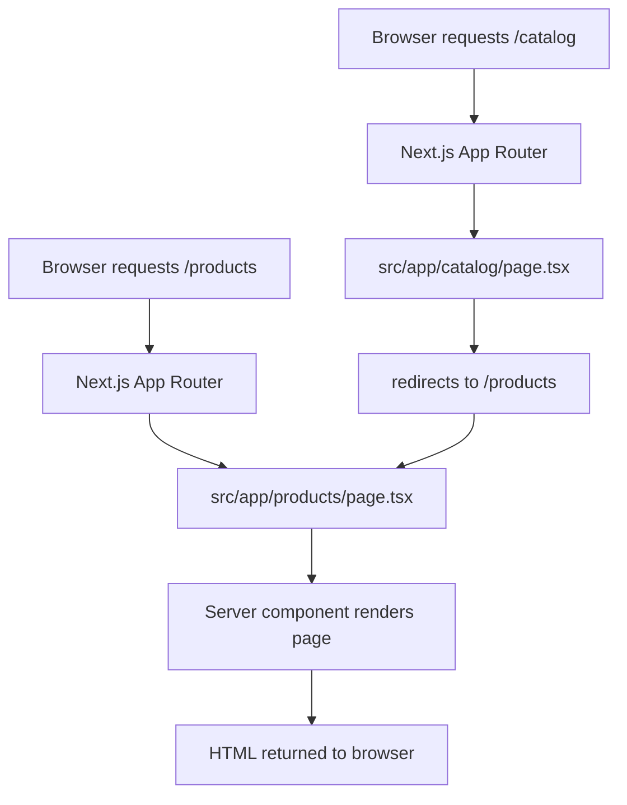

# Products Page Explained

This file explains how the new `Products` page works for a junior developer who has not used TypeScript or Next.js before.

## What this page does

- Defines a React page component for the route `/products`.
- Fetches product data from the backend endpoint `/api/products`.
- Converts the API response into a list of products.
- Displays product cards with name, description, and price.
- Shows a friendly message if no products are returned.

## Key files

- `src/app/products/page.tsx` — the page component for the `/products` route.
- `src/app/catalog/page.tsx` — redirects `/catalog` to `/products`.

## How Next.js page routing works

In Next.js App Router, the folder structure inside `src/app` becomes the website routes automatically.

- `src/app/page.tsx` becomes `/`
- `src/app/products/page.tsx` becomes `/products`
- `src/app/catalog/page.tsx` becomes `/catalog`

### Overview diagram



## How the code works

### TypeScript types

At the top of `page.tsx`, there is a small `Product` type:

```ts
type Product = {
  id?: string;
  name?: string;
  description?: string;
  price?: number;
  [key: string]: unknown;
};
```

This tells TypeScript what shape each product should have. The question marks `?` mean those fields are optional, so the code still works if the backend returns some fields missing.

### Fetching data from the backend

The `getProducts` function calls the backend endpoint:

```ts
async function getProducts() {
  const response = await fetch("/api/products", {
    cache: "no-store",
  });

  if (!response.ok) {
    throw new Error(`Unable to load products: ${response.status}`);
  }

  return response.json();
}
```

- `fetch` is the browser / Next.js function for calling HTTP endpoints.
- `cache: "no-store"` means the page will always request fresh data.
- `response.ok` checks whether the backend returned a successful status code.
- `response.json()` parses the endpoint response as JSON.

### Normalizing the product data

The backend endpoint may return products in different forms. The `normalizeProducts` function makes that safe:

```ts
function normalizeProducts(payload: unknown): Product[] {
  if (!payload) {
    return [];
  }

  if (Array.isArray(payload)) {
    return payload;
  }

  if (typeof payload === "object") {
    return Object.values(payload as Record<string, Product>);
  }

  return [];
}
```

It handles:

- an array of products like `[{id: 1, name: "A"}]`
- an object of products like `{ "1": {id: 1, name: "A"} }`
- missing or invalid payloads by returning an empty list.

### Rendering the page

The exported component is an async function:

```ts
export default async function ProductsPage() {
  const data = await getProducts();
  const products = normalizeProducts((data as { products?: unknown }).products ?? data);

  return (
    <main>...</main>
  );
}
```

Because it is `async`, Next.js can fetch the product data on the server before sending the HTML to the browser.

In the returned JSX:

- If there are no products, the page shows a helpful message.
- Otherwise, it renders a grid of product cards.
- Each product card uses `product.name`, `product.description`, and `product.price`.

### Redirecting `/catalog`

`src/app/catalog/page.tsx` contains a simple redirect:

```ts
import { redirect } from "next/navigation";

export default function CatalogPage() {
  redirect("/products");
}
```

That means if a user visits `/catalog`, Next.js automatically sends them to `/products`.

## Data flow diagram

```mermaid
flowchart TD
  Browser[Browser]
  Backend[/api/products endpoint]
  Page[Products page component]
  Data[JSON response]
  UI[Rendered product cards]

  Browser -->|GET /products| Page
  Page -->|fetch(/api/products)| Backend
  Backend -->|JSON payload| Page
  Page -->|normalizeProducts| Data
  Data -->|render| UI
  UI --> Browser
```

## Why this is helpful for a new developer

- The route is created automatically from the folder name.
- A page component can be `async` and fetch data before rendering.
- TypeScript helps by documenting the expected product shape.
- The code is written in a clear, step-by-step way:
  1. fetch data, 2. normalize data, 3. render UI.

## Where to look next

- `src/app/layout.tsx` for the app-level HTML wrapper.
- `src/app/page.tsx` for the home page.
- `src/app/catalog/page.tsx` to see a simple redirect.

This page is a good example of a server-rendered Next.js route that loads backend data and displays it immediately to the user.